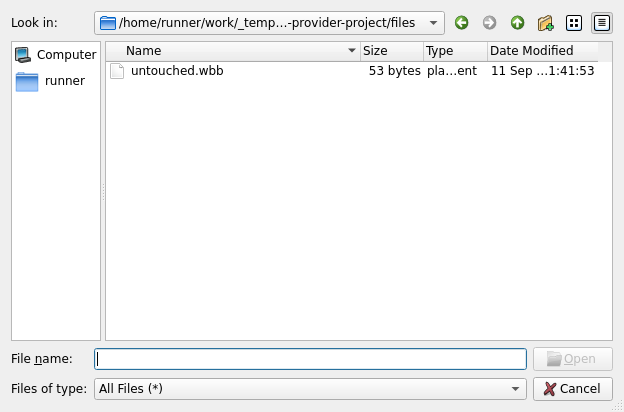

# Firefox real Qt provider: one qualification, 2026-09-11

This is retained research evidence for [#87](https://github.com/djibian/webeeblocks/issues/87), under [the bounded architecture decision](https://github.com/djibian/webeeblocks/issues/87#issuecomment-5607115679). It records one official-Webots-launched trial. The full controller lifecycle and Firefox file parity remain **UNPROVEN**.

## Exact provenance

- Research PR: [#301](https://github.com/djibian/webeeblocks/pull/301), candidate `c71548670a6a681b78fc9ffee3944eb6f1536828`, tree `02dc0bf3c094e375e168b8478cfde00f60a2f751`.
- Observed main/base: `8cb8122ed92920c8ff9ed7a5fb988ee9c7a5249a`.
- Canonical `.github/workflows/ci.yml` pull_request run: [34595203526](https://github.com/djibian/webeeblocks/actions/runs/34595203526), attempt 1, associated with that exact candidate. Its preparation job checked out GitHub's event merge SHA `00842b8899a286586fa2809e4d2869470b4ce7d2`; this is not the candidate SHA.
- Completed qualification job: [103249279101](https://github.com/djibian/webeeblocks/actions/runs/34595203526/job/103249279101), `Webots suite / crazyflie-runtime-wwi`, conclusion failure. The qualification returned exit 1 for UNPROVEN. No successful CI Gate or integration authorization is inferred from this result.
- Original artifact: [10261576980](https://github.com/djibian/webeeblocks/actions/runs/34595203526/artifacts/10261576980), `crazyflie-runtime-wwi-r2025a`, 204427 bytes.
- This directory preserves the original downloaded ZIP byte-for-byte before the advertised artifact expiry (2026-12-10). SHA256: `987e5f6b0debc18cd7d6ea9a109f445eaf91d366fd4796fb3fce5f9235cdd5b0`. The digest was checked against GitHub's artifact metadata and the downloaded bytes.
- Actual controller binary SHA256: `73fe425e08264bd19918e78c4e931ca38d3a78f2726132912af96450fb6124a5`. The binary itself is not contained in the original artifact; its build hash and characterization are retained.
- Official Webots R2025a Linux desktop archive SHA256: `c5127fb4206c57a5ae5523f1b7f3da8b670bc8926d9ae08595e139f226f38c38`; official runtime dependency recipe Git blob: `4593476be2c985580a0e1738671f4b5bae81f669`. The recipe is pinned; apt package versions are not all digest-pinned.
- The hash-checked C10 provider is from `fa78eb7dc8fd423abfd7e656a3bbf8c3e7e26c1c`. Provider source blob: `241e6e6aaec32ceaeaa2693fad337a774757b895`; runtime.ini blob: `27cbdb180b6f1aa4ed6a871bd9cb3ed147b29b6a`. Qualification instrumentation was added only to its temporary copy; both original and instrumented sources are archived.

## Observations

| Boundary | Retained observation |
| --- | --- |
| Compiled provider | Both C++ units use PIC. Actual readelf output has no Qt COPY relocation and no RPATH/RUNPATH. `QCoreApplication::self` is `R_X86_64_GLOB_DAT`. The real provider factory, `QCoreApplication::instance()`, qobject/metaobject roots and called dialog hook remain in nm output. |
| Official launch | Probe PID 3914 is the characterized controller executable and a descendant of the launched official Webots process 3888. `wb_robot_init()` returns before provider invocation. |
| Qt closure | ldd and live process maps resolve Qt, Controller and XCB through the R2025a bundle. DISPLAY is `:99`, with software rendering and no QPA override. |
| Real displayed dialog | QApplication initializes; QFileDialog is constructed and enters exec. Qt observes exposure and captures the window. Independent X11 inspection finds the same PID and window 6291463, IsViewable, 624 × 412. |
| Cancellation | The X11 observer verifies focus and sends one XTEST Escape press/release. The actual dialog returns Rejected and the provider factory returns. |
| Project files | The isolated sentinel file inventory remains unchanged. No Open, Save As or Save was invoked. This is not general cancellation-neutrality proof for a product broker. |
| Controller continuation | No `LOOP_RETURN`, capabilities response, provider destruction or controller-completion marker appears. Webots reports controller termination and exits 0. The harness records no timeout/exception and no fatal marker. |



The screenshot is copied unmodified from the archive (SHA256 `832a3761b1296333f612cda7b40c74bb300384f347cdac6c6c9edfa8c5b181bf`). It shows the real chooser and the untouched fixture, not a mock or a product-browser claim.

The terminal marker sequence in `webots.log` is:

```text
Q87 BEFORE_WB_INIT pid=3914
Q87 WB_INIT_RETURN
Q87 PROVIDER_CALLED
WEBEEBLOCKS_FILE_BROKER_V1 QT_APP_INITIALIZED
WEBEEBLOCKS_FILE_BROKER_V1 QFILEDIALOG_CONSTRUCTED
Q87 DIALOG_EXEC
Q87 DIALOG_EXPOSED pid=3914 wid=6291463 width=624 height=412
Q87 DIALOG_CANCELLED result=Rejected
Q87 PROVIDER_RETURNED
INFO: qt_provider_probe: Terminating.
```

## Interpretation and stopping boundary

The pre-registered harness produced `Q87_QUALIFICATION_RESULT=UNPROVEN`. The historical failure before QApplication initialization is not reproduced in this exact real-provider trial: initialization, displayed dialog, cancellation and factory return are directly observed. This extends the C26 evidence beyond the minimal standalone closure.

It does **not** establish the required return to the controller/WWI lifecycle. The probe emits its loop marker only after eight completed steps; the retained trace does not distinguish zero completed steps from a partial sequence, nor does it record the controller's own exit status. Webots exit 0 is not proof of controller completion. The cause of termination is not established. Do not relabel the result PASS, assert a new Qt crash, or infer that no initial loop iteration occurred from the missing aggregate marker.

The architecture decision's PASS criterion remains unmet. Its FAIL category for an established absence of return is not substituted for the missing step/exit observations: the evidence remains UNPROVEN at that boundary. This is an experiment result, not an independent review or GO for the research candidate.

One qualification has been executed. No rerun, second candidate or C27→C28→C29 discriminator chain is authorized by this record. The research harness is to be closed without merging. The remaining lifecycle boundary must stay explicit before product implementation; this record supplies neither a production broker nor Open/Save/Save As semantics, a browser WWI round-trip, complete Firefox parity or Windows qualification.

## Archive contents

`qualification-artifact.zip` contains the original 18 files under `crazyflie-runtime-wwi/firefox-qt-provider/`: raw preparation and Webots logs, result/static/X11 JSON, controller PID/maps, screenshot, compiler identity, binary/source/library hashes, readelf relocations/dynamic output, nm symbols, ldd, link map and original/instrumented provider source. The large symbol/link outputs remain compressed without alteration.

To inspect the retained files without executing a qualification:

```sh
sha256sum --check SHA256SUMS
unzip -l qualification-artifact.zip
unzip qualification-artifact.zip -d retained-observation
```
